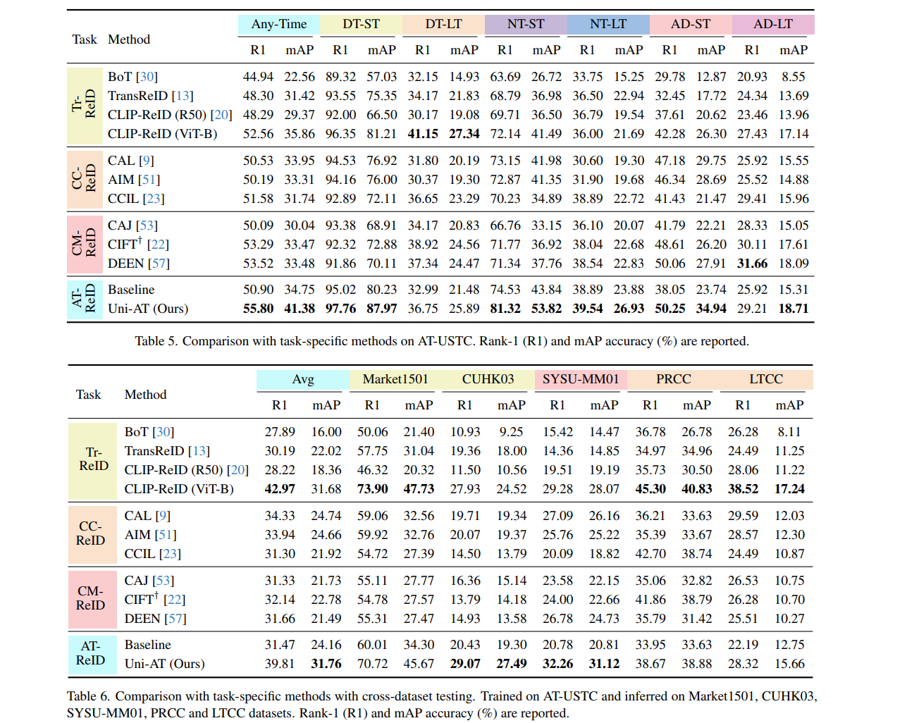

# AT-ReID

This folder keeps the original reference implementation of the paper *Towards Anytime Retrieval: A Benchmark for Anytime Person Re-Identification*. 🧪

### 1. 🚂 Training

You may need to manually define the data path first.

#### Common Flags

| Flag | Meaning | Notes |
| --- | --- | --- |
| `-gpu 0` | run on GPU 0 | replace `0` with the target GPU id if needed |
| `-v 1` | full Uni-AT model | used together with `-said -moae -hdw` |
| `-v 2` | baseline model | baseline setting |
| `-v 3` | unified embedding model | typically used with `-ncls 1` |
| `-said` | enable SAID loss | full Uni-AT setting |
| `-moae` | enable MOAE | full Uni-AT setting |
| `-hdw` | enable HDW | full Uni-AT setting |
| `-ncls 1` | use 1 CLS token | replaces the default 6 CLS tokens |

#### Full Uni-AT

```bash
python train.py -gpu 0 -v 1 -said -moae -hdw
```

#### Baseline Model

```bash
python train.py -gpu 0 -v 2
```

#### Unified Embedding Model

```bash
python train.py -gpu 0 -v 3 -ncls 1
```

### 2. 🧪 Testing

Use the same model-related flags during testing as those used in training.

Test a model by
```bash
python train.py -gpu 0 -v 1 -said -moae -hdw -test
```

Test a model on AT-USTC, Market1501[1], CUHK03[2], MSMT17[3], SYSU-MM01[4], RegDB[5], LLCM[6], PRCC[7], LTCC[8], and DeepChange[9] by 
```bash
python train.py -gpu 0 -v 1 -said -moae -hdw -test -test_all
```

#### Scenario-Agnostic Mixed Test

Unseen scenario-agnostic mixed test:

```bash
python train.py -gpu 0 -v 1 -said -moae -hdw -test -test_mix
```

| Method | Feature | Valid queries | R1 | R5 | R10 | R20 | mAP |
| --- | --- | ---: | ---: | ---: | ---: | ---: | ---: |
| Baseline | AD-LT/head-5 | 19,992 | 38.08 | 47.81 | 53.12 | 59.52 | 28.03 |
| Uni-AT | AD-LT/head-5 | 19,992 | 41.02 | 50.67 | 55.75 | 63.14 | 31.84 |

### 3. 📈 Results
#### Our version of IJCAI selected 18 images for each video clip, ultimately choosing 135K images. In the final version, we provide the original 403K images with more perspectives and poses to enhance intra-class diversity. The results have been updated in the arXiv and the table below.

<p align="center">        
    
</p>

### 4. 📚 Citation
Please kindly cite this paper in your publications if it helps your research:
```
@inproceedings{li2025ATreid,
  title     = {Towards Anytime Retrieval: A Benchmark for Anytime Person Re-Identification},
  author    = {Li, Xulin and Lu, Yan and Liu, Bin and Li, Jiaze and Yang, Qinhong and Gong, Tao and Chu, Qi and Ye, Mang and Yu, Nenghai},
  booktitle = {Proceedings of the Thirty-Fourth International Joint Conference on Artificial Intelligence, {IJCAI-25}},
  publisher = {International Joint Conferences on Artificial Intelligence Organization},
  editor    = {James Kwok},
  pages     = {1467--1475},
  year      = {2025},
  month     = {8},
  note      = {Main Track},
  doi       = {10.24963/ijcai.2025/164},
  url       = {https://doi.org/10.24963/ijcai.2025/164},
}
```

### 📖 References

[1] Liang Zheng, Liyue Shen, Lu Tian, Shengjin Wang, Jingdong Wang, and Qi Tian. Scalable person re-identification: A benchmark. ICCV, 2015.

[2] Wei Li, Rui Zhao, Tong Xiao, and Xiaogang Wang. Deepreid: Deep filter pairing neural network for person re-identification. CVPR, 2014.

[3] Longhui Wei, Shiliang Zhang, Wen Gao, and Qi Tian. Person transfer gan to bridge domain gap for person re-identification. CVPR, 2018.

[4] Ancong Wu, Wei-Shi Zheng, Hong-Xing Yu, Shaogang Gong, and Jianhuang Lai. Rgb-infrared cross-modality person re-identification. ICCV, 2017.

[5] Dat Tien Nguyen, Hyung Gil Hong, Ki Wan Kim, and Kang Ryoung Park. Person recognition system based on a combination of body images from visible light and thermal cameras. Sensors, 2017.

[6]  Yukang Zhang and Hanzi Wang. Diverse embedding expansion network and low-light cross-modality benchmark for visible-infrared person re-identification. CVPR, 2023.

[7] Qize Yang, Ancong Wu, and Wei-Shi Zheng. Person re-identification by contour sketch under moderate clothing change. IEEE TPAMI, 2019.

[8] Xuelin Qian, Wenxuan Wang, Li Zhang, Fangrui Zhu, Yanwei Fu, Tao Xiang, Yu-Gang Jiang, and Xiangyang Xue. Long-term cloth-changing person re-identification. ACCV, 2020.

[9] Peng Xu and Xiatian Zhu. Deepchange: A long-term person re-identification benchmark with clothes change. ICCV, 2023.


