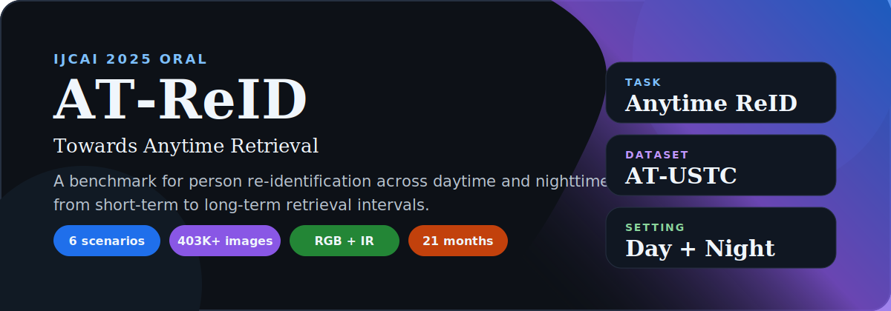
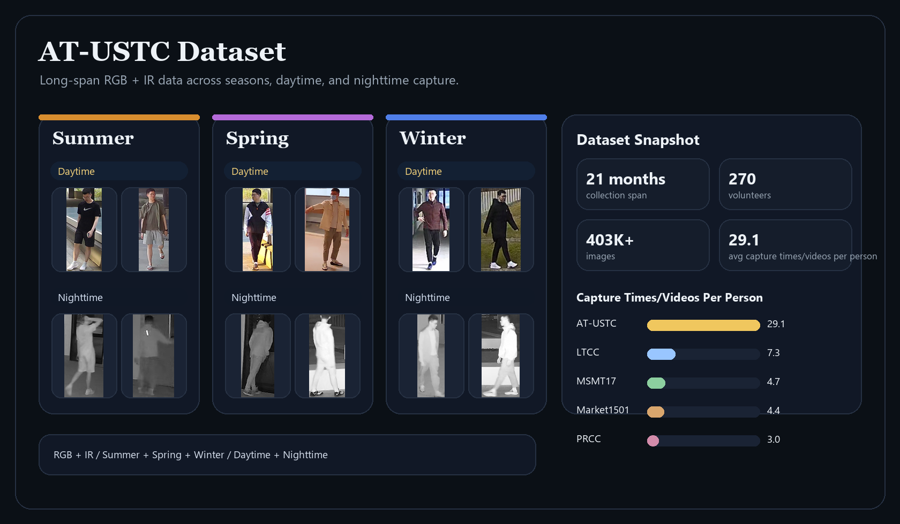

<div align="center">

# AT-ReID

### A Benchmark for Anytime Person Re-Identification

[](https://arxiv.org/abs/2509.16635)
[](https://doi.org/10.24963/ijcai.2025/164)
[](./AT-USTC%20Dataset%20Release%20Agreement.pdf)

**Towards Anytime Retrieval: A Benchmark for Anytime Person Re-Identification**

</div>

<p align="center">
  
</p>

> [!NOTE]
> This page is the overview and navigation page for the AT-ReID benchmark and the AT-USTC dataset.
> Detailed method descriptions and implementation details are kept in the corresponding subdirectories.

<div align="center">
<table>
  <tr>
    <td><strong>6 scenarios</strong><br>DT-ST / DT-LT / NT-ST / NT-LT / AD-ST / AD-LT</td>
    <td><strong>21 months</strong><br>long-span collection</td>
    <td><strong>270 volunteers</strong><br>rich repeated captures</td>
    <td><strong>403K+ images</strong><br>large-scale benchmark</td>
    <td><strong>RGB + IR</strong><br>cross-illumination coverage</td>
  </tr>
</table>
</div>

## Navigation

| Destination | Description |
| --- | --- |
| [Paper](https://arxiv.org/abs/2509.16635) | Read the IJCAI 2025 oral paper. |
| [Dataset Agreement](./AT-USTC%20Dataset%20Release%20Agreement.pdf) | Apply for AT-USTC dataset access. |
| [AT-ReID-fast](./AT-ReID-fast) | Enter the maintained project subdirectory. |
| [AT-ReID](./AT-ReID) | Enter the original project subdirectory. |
| [Task Introduction](https://zhuanlan.zhihu.com/p/1944895842541605129) | 中文任务介绍。 |
| [Dataset Introduction](https://zhuanlan.zhihu.com/p/1946682409371304382) | 中文数据集介绍。 |
| [Contact](mailto:lxlkw@mail.ustc.edu.cn) | Dataset and project inquiries. |

## AT-USTC Dataset

AT-USTC is built to support the AT-ReID benchmark, which studies person retrieval across daytime and nighttime, from short-term to long-term settings.
Compared with existing datasets, AT-USTC emphasizes long-span collection, repeated captures, rich clothing variation, and both RGB and IR camera footage.

<table>
  <tr>
    <td><strong>Collection period</strong><br>21 months</td>
    <td><strong>Volunteers</strong><br>270</td>
    <td><strong>Dates / scenes</strong><br>13 dates / 16 scenes</td>
  </tr>
  <tr>
    <td><strong>Modalities</strong><br>RGB + IR</td>
    <td><strong>Total images</strong><br>403K+</td>
    <td><strong>Average capture frequency</strong><br>29.1 times per volunteer</td>
  </tr>
</table>

<p align="center">
  
</p>

### Dataset Access

Please send a signed copy of the [Dataset Release Agreement](./AT-USTC%20Dataset%20Release%20Agreement.pdf) to **lxlkw@mail.ustc.edu.cn**.
If your application is approved, we will send the download link for the dataset.

### Split Summary

| Split | Content |
| --- | --- |
| Training | 286,087 images from 135 IDs |
| Validation | 55,060 images |
| Testing | 117,512 images from another 135 IDs |

AT-ReID constructs separate galleries and query sets for all six scenarios to support fine-grained evaluation across time and illumination changes.

## Citation

If this project helps your research, please cite:

```bibtex
@inproceedings{li2025ATreid,
  title     = {Towards Anytime Retrieval: A Benchmark for Anytime Person Re-Identification},
  author    = {Li, Xulin and Lu, Yan and Liu, Bin and Li, Jiaze and Yang, Qinhong and Gong, Tao and Chu, Qi and Ye, Mang and Yu, Nenghai},
  booktitle = {Proceedings of the Thirty-Fourth International Joint Conference on Artificial Intelligence, {IJCAI-25}},
  publisher = {International Joint Conferences on Artificial Intelligence Organization},
  editor    = {James Kwok},
  pages     = {1467--1475},
  year      = {2025},
  month     = {8},
  note      = {Main Track},
  doi       = {10.24963/ijcai.2025/164},
  url       = {https://doi.org/10.24963/ijcai.2025/164},
}
```

## Contact

If you have any questions, please feel free to contact us: **lxlkw@mail.ustc.edu.cn**
