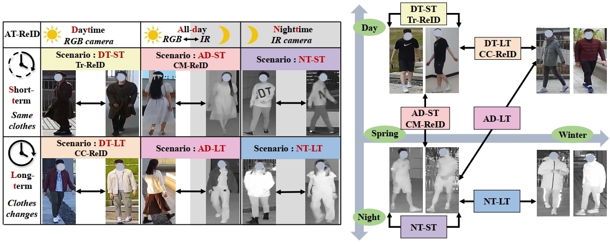
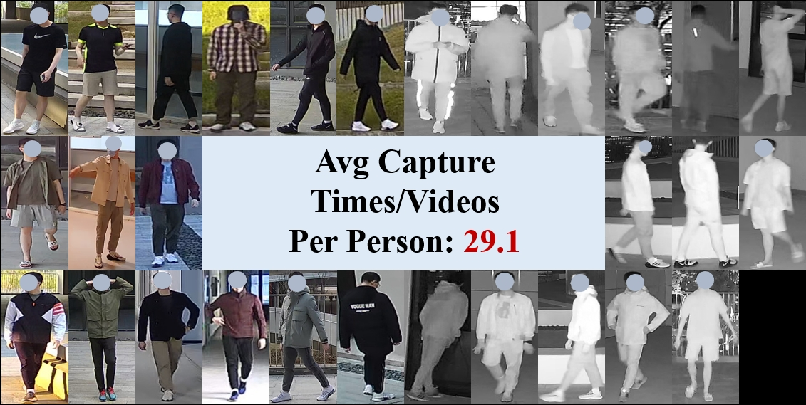

# AT-ReID

Official repository for **Towards Anytime Retrieval: A Benchmark for Anytime Person Re-Identification**.

## 🧭 Navigation

<table>
  <tr>
    <th align="center" width="25%">🎯 任务</th>
    <th align="center" width="25%">🗂️ 数据集</th>
    <th align="center" width="25%">🧠 方法</th>
    <th align="center" width="25%">🖼️ 科研绘图</th>
  </tr>
  <tr>
    <td align="center"><a href="#at-reid-task">📍 仓库内概览</a></td>
    <td align="center"><a href="#at-ustc-dataset">📍 仓库内概览</a></td>
    <td align="center"><a href="#method-navigation">📍 仓库内导航</a></td>
    <td align="center"><a href="https://github.com/kw66/research-figures">🎨 画图PPT</a></td>
  </tr>
  <tr>
    <td align="center"><a href="https://zhuanlan.zhihu.com/p/1944895842541605129">📘 知乎介绍</a></td>
    <td align="center"><a href="https://zhuanlan.zhihu.com/p/1946682409371304382">📘 知乎介绍</a></td>
    <td align="center"><a href="https://zhuanlan.zhihu.com/p/1947080865181078424">📘 知乎介绍</a></td>
    <td align="center">&nbsp;</td>
  </tr>
</table>

## 🎯 AT-ReID Task

AT-ReID is a benchmark for **anytime person re-identification**, which aims to retrieve a person at any time, including both daytime and nighttime, ranging from short-term to long-term.

Based on the timestamps of query and gallery images, AT-ReID can be categorized into six scenarios: daytime short-term (DT-ST), daytime long-term (DT-LT), nighttime short-term (NT-ST), nighttime long-term (NT-LT), all-day short-term (AD-ST), and all-day long-term (AD-LT).

<p align="center">
  
</p>

## 🗂️ AT-USTC Dataset

The AT-USTC dataset is constructed to support investigations in AT-ReID. Compared with existing datasets, AT-USTC stands out for its long collection period and the inclusion of both RGB and IR camera footage.

Our data collection spans **21 months**, and **270 volunteers** were photographed on average **29.1 times** across different dates or scenes, leading to rich intra-identity diversity in scene, clothing, and modality. The dataset covers **13 dates** and **16 scenes**, and all data were collected with volunteer consent.

<p align="center">
  
</p>

### 📥 Dataset Access

Please send a signed [Dataset Release Agreement](./AT-USTC%20Dataset%20Release%20Agreement.pdf) copy to **lxlkw@mail.ustc.edu.cn**. If your application is approved, we will send the download link for the dataset.

### 📊 Split Summary

| Split | IDs | Images | Notes |
| --- | ---: | ---: | --- |
| Training | 135 | 286,087 | Official training split |
| Validation | 135 | 55,060 | 20% held out from the training split |
| Testing | 135 | 117,512 | Another 135 IDs for evaluation |

The training and testing sets are split by identity in a 1:1 manner, and separate query/gallery sets are constructed for all six AT-ReID scenarios.

### 🗃️ Folder Structure

```text
AT-USTC/
├── p001-d01-c01/
│   ├── cam01-f0-0050.jpg
│   ├── cam01-f0-0100.jpg
│   └── ...
├── p001-d02-c02/
│   └── ...
└── ...
```

### 🏷️ File Naming

Example: `AT-USTC/p001-d01-c01/cam01-f0-0050.jpg`

| Token | Meaning | Range / Notes |
| --- | --- | --- |
| `p001` | person ID | `1-270` |
| `d01` | capture date ID | `1-13` |
| `c01` | clothing ID | clothing ID for the corresponding person |
| `cam01` | camera ID | `1-8` are RGB cameras, `9-16` are infrared cameras |
| `0050` | frame ID | frame ID of the video segment |
| `f0` | split flag | `0` training, `1` validation, `2-10` testing protocol |

### 🎛️ Scenario Flags

| Scenario | Query | Gallery |
| --- | --- | --- |
| DT-ST | `2` | `6` |
| DT-LT | `3` | `7` |
| NT-ST | `4` | `8` |
| NT-LT | `5` | `9` |
| AD-ST | `2,4` | `6,8` |
| AD-LT | `3,5` | `7,9` |

### 🧪 Evaluation Protocol

- Training and testing identities are split in a `1:1` manner.
- Separate query/gallery sets are constructed for all six AT-ReID scenarios.
- Pure multi-shot evaluation may produce overly high rank-1 values, while pure single-shot evaluation weakens the meaning of mAP.
- Therefore, for each identity video clip with the same ID, camera, and clothing, we select **3 query images** and **3 gallery images**.
- Under this protocol, the gallery contains about **25 images per identity**, which is close to the multi-shot conditions of datasets such as Market1501, MSMT17, and PRCC.

## 🧠 Method Navigation

The root README only provides the task overview, dataset overview, and entry links.

- [`AT-ReID-fast/`](./AT-ReID-fast): 🚀 recommended entry point for training and evaluation.
- [`AT-ReID/`](./AT-ReID): 🧪 original reference implementation.

## 📚 Citation

If this project helps your research, please cite:

```bibtex
@inproceedings{li2025ATreid,
  title     = {Towards Anytime Retrieval: A Benchmark for Anytime Person Re-Identification},
  author    = {Li, Xulin and Lu, Yan and Liu, Bin and Li, Jiaze and Yang, Qinhong and Gong, Tao and Chu, Qi and Ye, Mang and Yu, Nenghai},
  booktitle = {Proceedings of the Thirty-Fourth International Joint Conference on Artificial Intelligence, {IJCAI-25}},
  publisher = {International Joint Conferences on Artificial Intelligence Organization},
  editor    = {James Kwok},
  pages     = {1467--1475},
  year      = {2025},
  month     = {8},
  note      = {Main Track},
  doi       = {10.24963/ijcai.2025/164},
  url       = {https://doi.org/10.24963/ijcai.2025/164},
}
```

## 📮 Contact

If you have any questions, please feel free to contact us: **lxlkw@mail.ustc.edu.cn**
